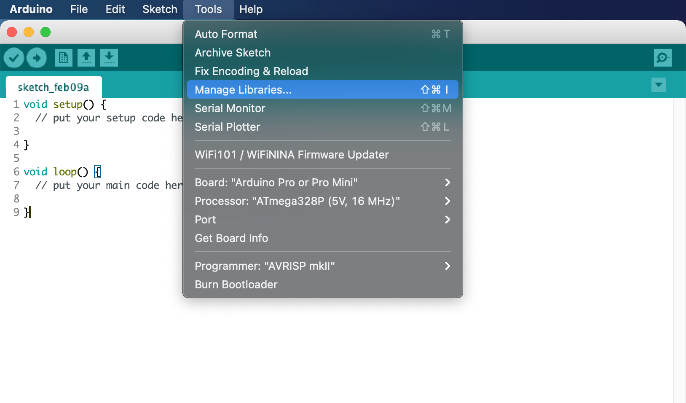
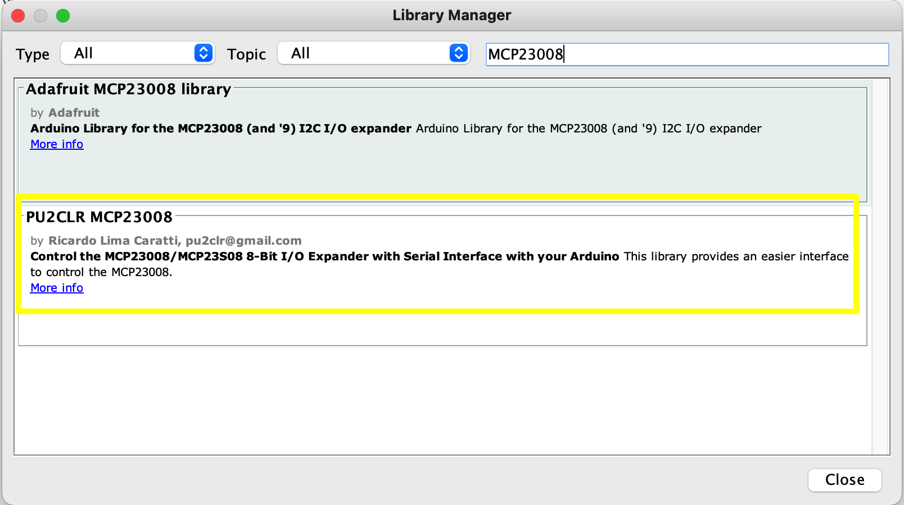
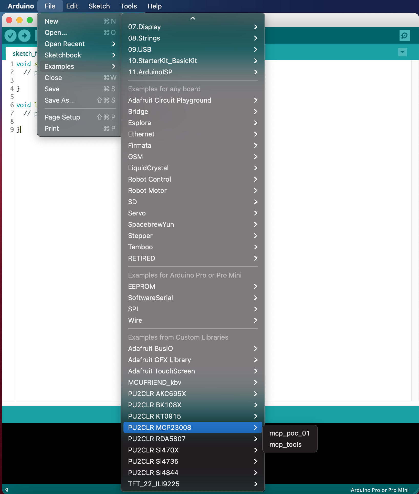
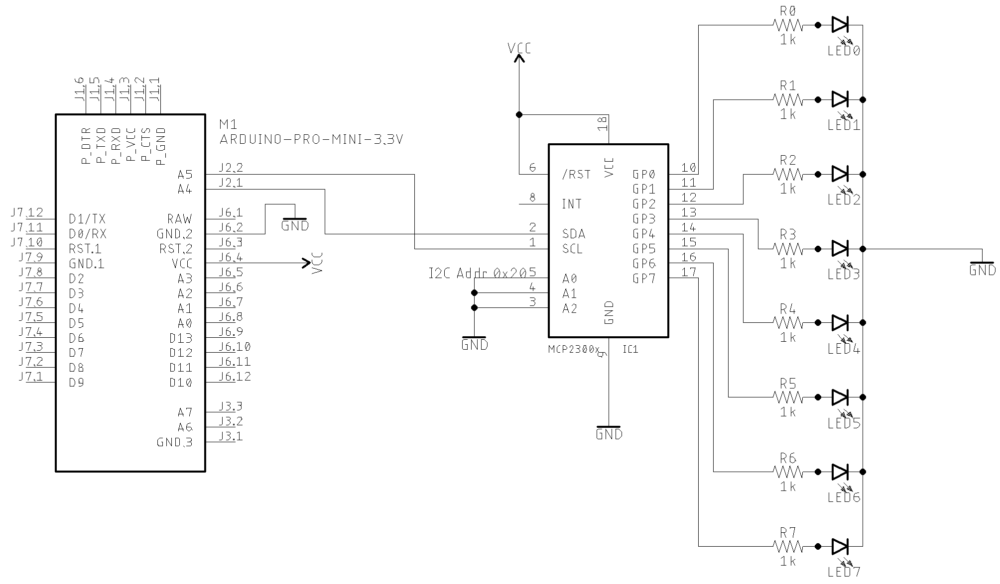
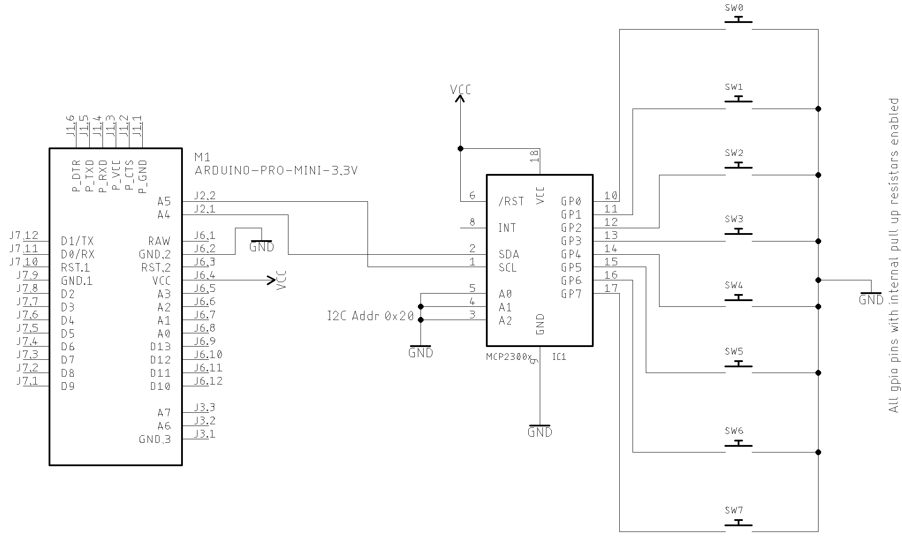
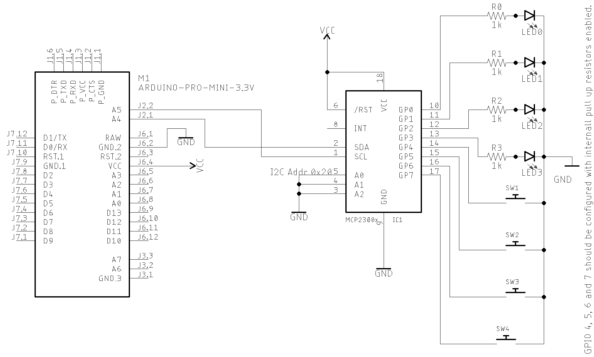

# [PU2CLR - MCP23008 Arduino Library](https://pu2clr.github.io/MCP23008/)

It is an Arduino Library to control the MCP23008/MCP23S08 8-Bit I/O Expander. 

The MCP23008 device provides 8-bit, general purpose, parallel I/O expansion. It can be controlled via I2C bus applications. It is a great and inexpensive device that allow you to add more devices to be controlled by your Arduino board via I2C protocol.

This Arduino library implements the most important functions available on MCP23008 device  and can be freely distributed using the MIT Free Software model. 

[Copyright (c) 2021 Ricardo Lima Caratti](https://pu2clr.github.io/MCP23008/#mit-license).

## Contents

1. [License Copyright](https://pu2clr.github.io/MCP23008/#mit-license)
2. [Thanks](https://pu2clr.github.io/MCP23008/#thanks)
3. [Labrary Features](https://pu2clr.github.io/MCP23008/#labrary-features)
4. [Library Installation](https://pu2clr.github.io/SI4735/#library-installation)
5. [API documentation](https://pu2clr.github.io/MCP23008/extras/apidoc/html/)
6. [Basic Schematic](https://pu2clr.github.io/SI4735/#basic-schematic)
7. [References](https://pu2clr.github.io/SI4735/#references)


## MIT License 

Copyright (c) 2019 Ricardo Lima Caratti

Permission is hereby granted, free of charge, to any person obtaining a copy of this software and associated documentation files (the "Software"), to deal in the Software without restriction, including without limitation the rights to use, copy, modify, merge, publish, distribute, sublicense, and/or sell copies of the Software, and to permit persons to whom the Software is furnished to do so, subject to the following conditions:

The above copyright notice and this permission notice shall be included in all copies or substantial portions of the Software.

THE SOFTWARE IS PROVIDED "AS IS", WITHOUT WARRANTY OF ANY KIND, EXPRESS OR IMPLIED, INCLUDING BUT NOT LIMITED TO THE ARRANTIES OF MERCHANTABILITY, FITNESS FOR A PARTICULAR PURPOSE AND NONINFRINGEMENT. IN NO EVENT SHALL THE AUTHORS OR COPYRIGHT HOLDERS BE LIABLE FOR ANY CLAIM, DAMAGES OR OTHER LIABILITY, WHETHER IN AN ACTION OF CONTRACT, TORT OR OTHERWISE, ARISING FROM, OUT OF OR IN CONNECTION WITH THE SOFTWARE OR THE USE OR OTHER DEALINGS IN THE SOFTWARE.

## Thanks

* Mrs. [Nancy Daniels Yoga](https://github.com/LadyRoninEngineer/Si473x) for sharing experiences and suggestions about the MCP23008 applications.

## Labrary Features

This library uses the I²C communication protocol and implements most important functions offered by MCP23008 device from MicroChip. It also has primitive functions that make it easier to implement commands that may not have been implemented yet. The main features implemented can be seen below:

* GPIO individual control (8 I/O pins)
* Reading and writing Access to all registers (0x00 ~ 0xA) 
* Internal pull up GPIO resistors control
* I2C address customization (0x20 ~ 0x27)
 

### Registers

This library has two basic function that you can use to control everything on MCP23008. You can use [getRegister](https://pu2clr.github.io/MCP23008/extras/apidoc/html/class_m_c_p.html#a490e4a6820e3a2e0dd86c1a7aa5bb920) and [setRegister](https://pu2clr.github.io/MCP23008/extras/apidoc/html/class_m_c_p.html#aba8f4501efb5a9772a5b7ec7a428ac4d) methods to setup the registers below. Also this library has other functions that make the job easier to build applications based on Arduino and MCP23008 devices. See [API documentation](https://pu2clr.github.io/MCP23008/extras/apidoc/html/).

| Register | Value | Description |
| -------- | ----- | ------------|
| IODIR    | 0x00  | Controls the direction of the data I/O. When  a  bit  is  set,  the  corresponding  pin  becomes  an input.  When  a  bit  is  clear,  the  corresponding  pin becomes an output.|
| IPOL     | 0x01  | The IPOL  register  allows  the  user  to  configure  thepolarity on the corresponding GPIO port bits.|
| GPINTEN  | 0x02  | The GPINTEN register controls the interrupt-on-change feature for each pin. |
| DEFVAL   | 0x03  | The default  comparison  value  is  configured  in  the DEFVAL register.|
| INTCON   | 0x04  | The INTCON register controls how the associated pin value is compared for the interrupt-on-change feature. |
| IOCON    | 0x05  | The IOCON register contains several bits for configuring the device. |
| GPPU     | 0x06  | The GPPU register controls the pull-up resistors for the port  pins. |
| INTF     | 0x07  | The INTF register reflects the interrupt condition on the port pins of any pin that is enabled for interrupts via the GPINTEN register.|
| INTCAP   | 0x08  | The INTCAP register captures the GPIO port value at the  time  the  interrupt  occurred. |
| GPIO     | 0x09  | The GPIO  register  reflects  the  value  on  the  port. |
| OLAT     | 0x0A  | The OLAT  register  provides  access  to  the  output latches. |


Also this library has other functions that make the job easier to build applications. See [API documentation](https://pu2clr.github.io/MCP23008/extras/apidoc/html/).


## Library Installation

__Under construction..__ 

You can install this library on your Arduino environment using different methods. The best ways to do that are described below.  

### Installing via Arduino IDE

This is the easiest method to install this library.

On Arduino IDE, select the __"Manager Libraries..."__ iten and look for MCP23008. Finally select "PU2CLR MCP23008". The images below show the installation process. 


#### Going to Manager libraries...




#### Looking for MCP23008




#### Checking the PU2CLR_MCP23008 examples




#### More information

See also [Installing an Arduino Library ](https://learn.sparkfun.com/tutorials/installing-an-arduino-library/using-the-arduino-library-manager)


### Installing via this repository 

First, you have to [download](https://github.com/pu2clr/MCP23008/archive/main.zip) this library in zip format. 
After, unzip the MCP23008-master.zip file in your Arduino Library folder. 

* On __Windows__: "My Documents\Arduino\libraries"
* On __MAC OS__: ˜/Documents/Arduino/libraries
* On __Linux__: ˜/Documents/Arduino/libraries

With that approach, you will have the __most current version__ of the library. However, __it may not be the most stable version__. This is because the current version is always in development. [Prefer releases](https://github.com/pu2clr/MCP23008/releases).
Do you need some old version (release) of this library?  If yes, [check here](https://github.com/pu2clr/MCP23008/releases). 


## Basic schematic

The image below shows a basic MCP23008 application with LED. You can control up to 8 LEDs. The I2C bus address is set to 0x20. You can select another I2C address by dealing with the A0,A1 and A2 pins (from 0x20 to 0x27). This circuit uses the MCP23008 GPIO PINs as output.   

### GPIO as output setup




#### Arduino setup suggestion

```cpp
#include <pu2clr_mcp23008.h>

MCP mcp;

void setup() {
  mcp.setup(0x20, 0); // I2C Address 0x20 and all GPIO pins configured to output
```

You also can use the methos setRegister as shown below (See MCP23008 IODIR register)

```cpp
    mcp.setRegister(REG_IODIR, 0B00000000);    // Sets  all GPIO pins to output
```


### GPIO as input setup





#### Arduino setup suggestion

```cpp
void setup() {
  mcp.setup(0x20, 0B11111111); // I2C Address 0x20 and all GPIO pins configured to input
```

You also can use the methos setRegister as shown below (See MCP23008 IODIR register)

```cpp
    mcp.setRegister(REG_IODIR, 0B11111111);    // Sets  all GPIO pins to input
```


### GPIO as input and output setup





```cpp
#include <pu2clr_mcp23008.h>

MCP mcp;

void setup() {
  mcp.setup(0x20, 0B00001111); // I2C Address 0x20, GPIO 0-3 are output and  4-7 are input
```

You also can use the methos setRegister as shown below (See MCP23008 IODIR register)

```cpp
    mcp.setRegister(REG_IODIR, 0B00001111);    // Sets  GPIO pins 0-3 to output and  GPIO pins 4-7 to input
```


## References 

* [MicroChip - MCP23008/MCP23S08 - 8-Bit I/O Expander with Serial Interface](https://ww1.microchip.com/downloads/en/DeviceDoc/21919e.pdf)
* [Nancy Daniels Yoga](https://github.com/LadyRoninEngineer/)  


<BR>


